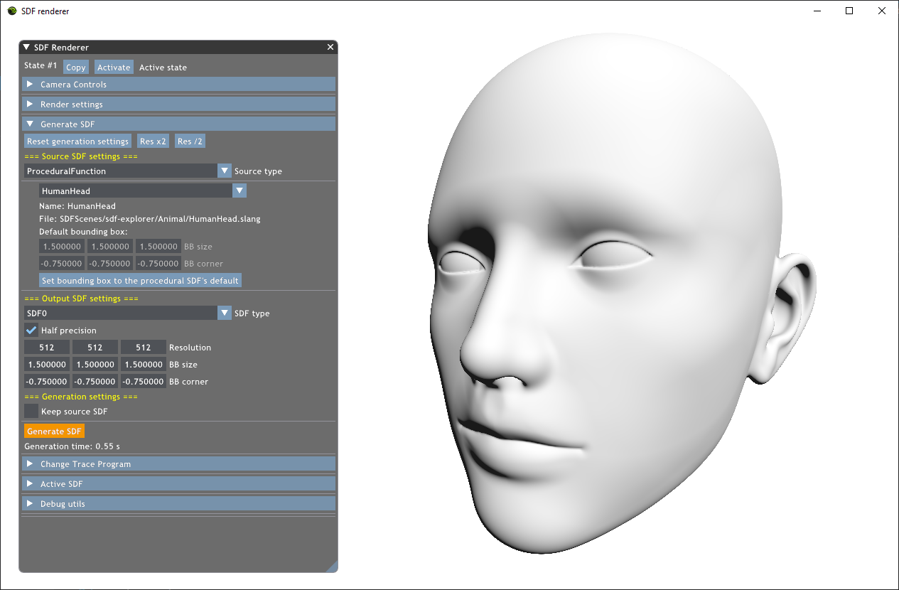

# Automatic Step Size Relaxation in Sphere Tracing
## The SDFRenderer project

This project (https://github.com/Bundas102/auto-relaxed-trace) contains the implementation for the Eurographics 2023 Short Paper: *Automatic Step Size Relaxation in Sphere Tracing*, Róbert Bán and Gábor Valasek. URL: https://doi.org/10.2312/egs.20231014

The project implements signed distance function and field rendering using sphere tracing and its variants.

The project uses procedural SDFs from (https://github.com/tovacinni/sdf-explorer) ported to HLSL/Slang.

## Building and running the project
- The project requires [Falcor 5.1](https://github.com/NVIDIAGameWorks/Falcor/tree/5.1)
- Copy the files of this repository into `Falcor/Source/Samples/SDFRenderer`
- Open `Falcor.sln` in Visual Studio and add `SDFRenderer.vcxproj` to the solution
- Set `SDFRenderer` as the Startup Project, Build
- Tested config: Visual Studio 2019, Windows 10 SDK (10.0.19041.0)
- Known issue: Falcor does not build with the Visual Studio 2022 platform toolset (v143), v142 needs to be used instead
